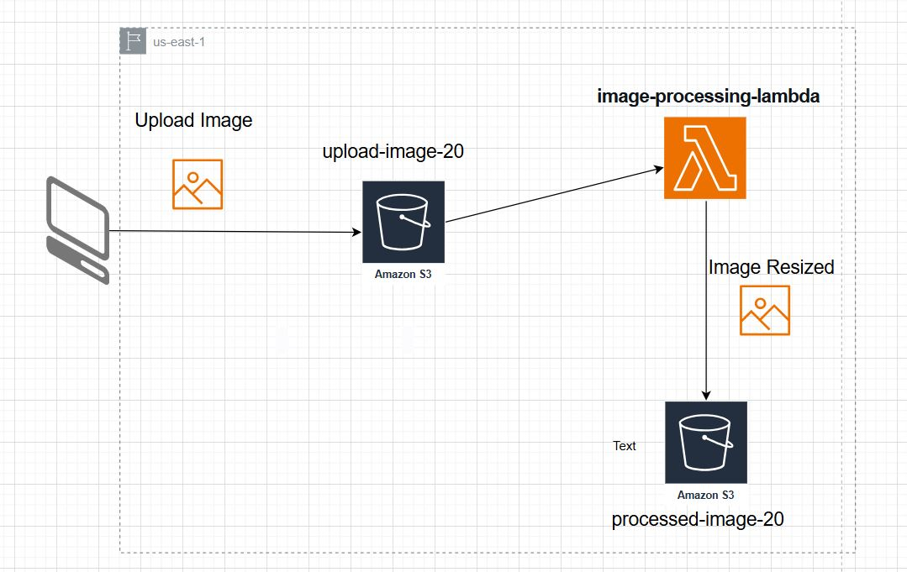

# serverless-image-processing-application
Create a serverless image processing application where users upload images to an S3 bucket, triggering an AWS Lambda function that processes and resizes the images before storing them in another S3 bucket.
# Serverless Image Processing on AWS

## 📌 Overview

This project demonstrates a **serverless image processing pipeline**
using AWS services.\
Users upload an image to an **Amazon S3 bucket**, which triggers a
**Lambda function** that resizes the image and stores the processed
result in another **S3 bucket**.
## Video Demo
https://drive.google.com/file/d/1JsiVkbdgU10yOQ_eZi0ecbISR7TJz4Mx/view?usp=sharing

## 🏗️ Architecture



### Components

1.  **Amazon S3 (upload-image-20)**
    -   Acts as the input bucket.\
    -   Users upload raw/original images here.
2.  **AWS Lambda (image-processing-lambda)**
    -   Triggered automatically when a new object is uploaded to the
        input bucket.\
    -   Processes (e.g., resizes) the image using the AWS SDK and an
        image processing library like
        [Sharp](https://github.com/lovell/sharp) or Pillow.\
    -   Writes the processed image to the output bucket.
3.  **Amazon S3 (processed-image-20)**
    -   Acts as the output bucket.\
    -   Stores resized/processed images.

## 🔄 Flow

1.  User uploads an image → **upload-image-20** (S3 bucket).\
2.  S3 event notification triggers → **image-processing-lambda**.\
3.  Lambda resizes the image.\
4.  Resized image is saved in → **processed-image-20** (S3 bucket).

## ⚙️ Setup Instructions

### 1. Create S3 Buckets

-   Create two S3 buckets:
    -   `upload-image-20`
    -   `processed-image-20`

### 2. Create IAM Role for Lambda

-   Allow permissions for:
    -   `s3:GetObject` from `upload-image-20`
    -   `s3:PutObject` into `processed-image-20`
    -   CloudWatch Logs (for monitoring)

### 3. Create Lambda Function

-   Name: `image-processing-lambda`
-   Runtime: Node.js (with **Sharp**) or Python (with **Pillow**)
-   Attach IAM role created above.
-   Configure S3 trigger:
    -   Event type: `PUT`
    -   Bucket: `upload-image-20`

### 4. Upload Lambda Code
```
import {
  S3Client,
  GetObjectCommand,
  PutObjectCommand,
} from "@aws-sdk/client-s3";
import sharp from "sharp";

const S3 = new S3Client();
const DEST_BUCKET = process.env.processed-image-20 ;
const THUMBNAIL_WIDTH = 200; // px
const SUPPORTED_FORMATS = {
  jpg: true,
  jpeg: true,
  png: true,
};

export const handler = async (event, context) => {
  const { eventTime, s3 } = event.Records[0];
  const srcBucket = s3.bucket.name;

  // Object key may have spaces or unicode non-ASCII characters
  const srcKey = decodeURIComponent(s3.object.key.replace(/\+/g, " "));
  const ext = srcKey.replace(/^.*\./, "").toLowerCase();

  console.log(`${eventTime} - ${srcBucket}/${srcKey}`);

  if (!SUPPORTED_FORMATS[ext]) {
    console.log(`ERROR: Unsupported file type (${ext})`);
    return;
  }

  // Get the image from the source bucket
  try {
    const { Body, ContentType } = await S3.send(
      new GetObjectCommand({
        Bucket: srcBucket,
        Key: srcKey,
      })
    );
    const image = await Body.transformToByteArray();
    // resize image
    const outputBuffer = await sharp(image).resize(THUMBNAIL_WIDTH).toBuffer();

    // store new image in the destination bucket
    await S3.send(
      new PutObjectCommand({
        Bucket: processed-image-20 ,
        Key: srcKey,
        Body: outputBuffer,
        ContentType,
      })
    );
    const message = `Successfully resized ${srcBucket}/${srcKey} and uploaded to ${DEST_BUCKET}/${srcKey}`;
    console.log(message);
    return {
      statusCode: 200,
      body: message,
    };
  } catch (error) {
    console.log(error);
  }
};
```
### Environment Variables
Remember set the DEST_BUCKET in your Lambda's "Configuration" tab. To do this, open your Lambda in the AWS Console, select the "Configuration" tab, then click "Environment variables"
```
DEST_BUCKET=processed-image-20 
```

### 5. Test the Workflow

-   Upload an image (`.jpg`, `.png`, etc.) to `upload-image-20`.
-   Lambda is triggered automatically.
-   Check the `processed-image-20` bucket for the resized version.

## 📊 Monitoring

-   Use **CloudWatch Logs** to debug Lambda executions.
-   Configure **CloudWatch Metrics/Alarms** for error monitoring.

## 🚀 Future Enhancements

-   Add API Gateway for HTTP image uploads.
-   Store metadata in DynamoDB (filename, size, timestamp).
-   Support multiple image transformations (watermark, grayscale, etc.).
-   Use AWS Step Functions for complex workflows.
